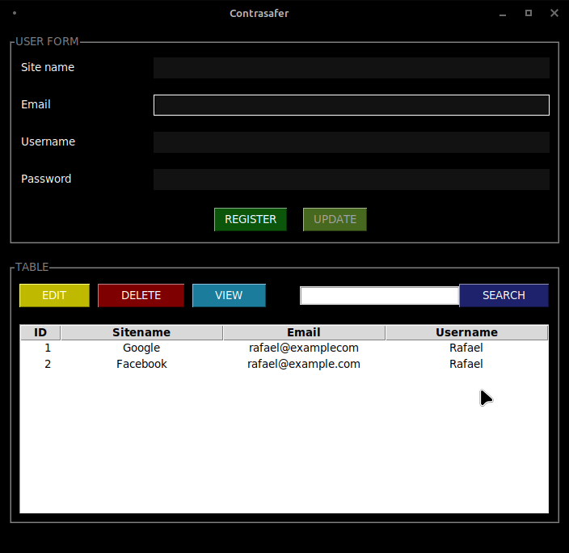

# Contrasafer

### About

**Contrasafer** is a small application for saving passwords in a SQLite database. You can add, edit, view and delete your passwords

**NOTE**: I used this app just for practice, I will integrate new features

### Installation

```bash
# Clone the repo
$ git clone https://github.com/RafaelHorta/contrasafer.git

# Change the working directory to "contrasafer"
$ cd contrasafer

# Install the requeriments
$ pip install -r requeriments.txt
```

### Start

```bash
$ python contrasafer.py
```

### Screenshots


